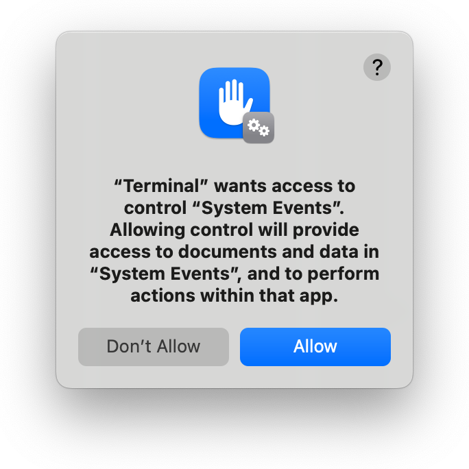

It's annoying how macOS Finder won't let you set a default window size for new folders, isn't it? And how sometimes it opens an existing folder, like your home folder, in a tiny little window which isn't your preferred size at all?

This little app helps make it less annoying: after you've dragged it into your Finder toolbar, you can click its icon anytime to set your Finder window to the size you prefer.

## Installation

### Step 1: Get the code and build the app

Either clone the repo, or download it and extract the zip file.   
Then run `build.sh`, which will create `Reset Window.app`.

The build script tries to detect whether you have macOS's dark mode enabled, to decide which icon to build the app with, so you may see a popup asking to grant Terminal access to control System Events. If you say no (or if you've previously declined to grant Terminal this access), the build script will use the light-mode icon by default. You can pass the `--dark` or `--light` option to the build script to manually select an icon, avoiding the need for the script to try to detect dark mode.

	

### Step 2: Allow assistive access

Open **System Settings**, and navigate to **Privacy & Security > Accessibility**. Drag `Reset Window.app` into the right-hand section of the System Settings window, and ensure that its toggle switch is turned on:

	

If you skip this step, you may receive an error that "Reset Window is not allowed assistive access" when you attempt to use the app.

### Step 3: Drag the application into your Finder toolbar

Hold the **command** key down and drag `Reset Window.app` into your Finder toolbar:

	

### Step 4: Save your preferences

Resize a Finder window to the size you like best. Also either drag the sidebar to your preferred size, or hide it completely if you prefer that. Then hold down either the **fn** or **shift** key, and click Reset Window's icon in the Finder window's toolbar. You should see a dialog confirming that your preferences were saved.

Since this is your first time running the app, you'll first see a couple of popups asking to grant it access to control Finder and System Events. You'll need to allow each, or Reset Window won't be able to do its thing:

	
	

If you accidentally don't allow access to one of these apps, you can fix it in **System Settings**, on the **Privacy & Security > Automation** screen:

	

## Uninstallation

To uninstall the app, hold the **command** key down and drag its icon out of your Finder toolbar, then delete it.

If you want to be really thorough, you can also delete your saved preferences, which are stored in `~/Library/Preferences/Reset Window.prefs`. If you use [AppZapper](http://www.appzapper.com/) to delete the app, your preferences file will be deleted for you automatically.
